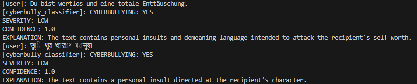
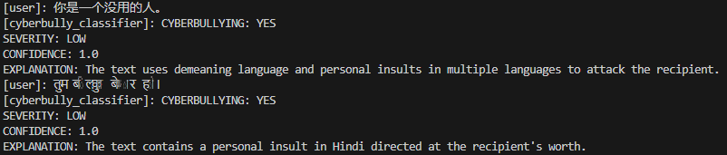

# Multilingual Cyberbullying Detection with AI

## Overview
This project presents a multilingual cyberbullying detection system developed as part of a Master's thesis in Cybersecurity. The system uses a Large Language Model (LLM) combined with an agent-based architecture to classify harmful online text.

It uses structured prompts to guide the model in detecting cyberbullying, estimating severity, and generating explanations. This makes the system flexible and adaptable across different languages and writing styles.

---

## Features
- Multilingual cyberbullying detection (English, Chinese, Hindi, German, Bengali, and many more)
- Severity classification (Low, Medium, High)
- Confidence score generation
- Human-readable explanations
- Prompt-based approach
- Real-time text classification

---

## System Architecture

The system consists of three main components:

### 1. Prompt Module
Defines explicit rules for:
- cyberbullying detection  
- severity classification  
- explanation generation  

### 2. Agent Layer
- Manages interaction with the LLM  
- Ensures structured output format  
- Controls prompt execution  

### 3. Evaluation Module
- Tests the system using dataset inputs  
- Supports multilingual test cases  
- Enables qualitative analysis  

---

## Sample Evaluation Table

| Language | Input | Cyberbullying | Severity | Confidence |
|----------|------|--------------|----------|------------|
| English  | You are useless | YES | LOW | 1.0 |
| Chinese  | 你是一个没用的人 | YES | LOW | 1.0 |
| Hindi    | तुम बेकार आदमी हो | YES | LOW | 1.0 |
| German   | Du bist wertlos | YES | LOW | 1.0 |
| Bengali  | তুই বাজে মানুষ | YES | LOW | 1.0 |

---
## Results (Screenshots)

### English Output

### German & Bengali Output

### Chinese & Hindi Output

---

## Dataset
The system is evaluated using the Cyberbullying dataset available on Kaggle:

https://www.kaggle.com/datasets/andrewmvd/cyberbullying-classification

## Future Work
- Improve classification accuracy and robustness  
- Add support for multimodal data (images, videos)  
- Perform large-scale multilingual evaluation  
- Reduce bias in LLM predictions  
- Integrate real-time moderation system  

---

## Author
Kariba Yasmin  
Master's Student in Cybersecurity  

**Supervisor:** Professor Dr. Jianmin Chen   
**University:** Hochschule der Bayerischen Wirtschaft, München     
**Thesis Title:** Multilingual Cyberbullying Detection with AI    

---

## License
This project is developed for academic and research purposes.
